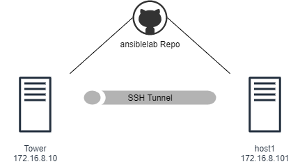

# ¡1er Reto! Automation2021

¡Saludos Ninjas!

Nuestro primer reto consiste en: realizar un **healt check** de forma remota en el sistema *host1* (de nuestro laboratorio) y publicarlo en sitio web que expone el mismo http://localhost/health-checks/.   

> Considero que es posible completar este reto utilizando lo aprendido durante los entrenamientos pasados y apoyandose con algún material públicado en Internet =)    
   

#### Diagrama del Laboratorio

---

## Instrucciones

Para lograr completar este reto deberán:

1. Desplegar el [Dojo](https://github.com/karkul/ansiblelab) (Lab) en nuestra laptop (Workstation).

1. Clonar el repositorio de git de nuestro Dojo https://github.com/karkul/ansiblelab.git dentro de la VM llamada Tower para trabajar de forma local en nuestro ambiente de desarrollo.

1. Crear un branch con su nombre y utilizarlo para trabajar en sus modificaciones *para no afectar la rama principal*.

1. Completar nuestros playbook `main.yaml` para que:
    - Copie de la carpeta *files* el archivo `healt-check.sh` en el servidor.
    - Le asigne los permisos necesarios para su ejecución.
    - Lo mandé a ejecutar.
    - Envie el archivo de salida (o lo copie) a la carpeta /var/www/html/health-checks (previa creación del directorio).
    - Y por ultimo **envié una notificación a través del Bot de Slack al canal #general** para saber quienes lo han podido completar.

El primer Ninja que lo logre será acredor a que su código sea promovido al branch Master y sea reconocido como *Ninja Chunin (L2)*. Así mismo, se le darán puntos extra a aquel que le ponga un *plus* a este reto.
    
> A lo largo del tiempo iré publicando algunos *hints* en nuestro canal de slack para orientar el camino a seguir.

**Happy Hacking!**