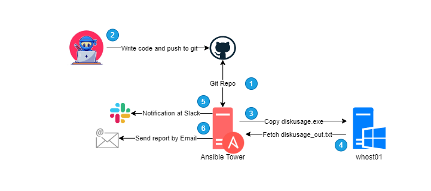

# ¡2do Reto Automation2021! (Basado en un caso de uso real)

## Descripción

Este reto consiste en poder ejecutar un análisis de ocupación de disco de forma remota en sistemas Windows y mandar el resultado mediante un reporte a través un correo electrónico. Todo esto desde **Ansible Tower**.

> La ejecución final deberá ser realizada desde un job template o un workflow template (preferentemente) desde la interface de **Ansible Tower** utilizando variables dinámicas dentro de los playbooks.

### Diagrama de Alto Nivel del 2do Reto Ninja

## Pre-requisitos
1. Levantar una VM de Windows dentro de nuestro laboratorio.

> Para este punto puedes hacerlo a través de Vagrant agregando la definición del box de Windows a nuestro `Vagrantfile` o bien hacer la creación de una VM Windows de forma manual en VirtualBox o cualquier otro Virtualizador de tu preferencia (Hyper-V, VMware Workstation, etc).

2. Habilitar el [Windows Remote Shell](https://docs.microsoft.com/en-us/troubleshoot/windows-server/remote/how-to-enable-windows-remote-shell)

3. Validar la comunicación entre los host *tower* y la *vm windows*

Puedes utlizar la [Guía de Automatizacion de Windows con Ansible](https://drive.google.com/file/d/1oegYWyDd_y9sD6Axdy9IubPaXvc0HZmz/view?usp=sharing) (pag. 50) como referencia para realizar las configuraciones necesarias para habilitar el ambiente de pruebas.

> Esta guía es de uso interno, así es que les pido que por favor no la compartan a nadie fuera de este entrenamiento.

## Detalle técnico

### Lab Setup

Para llevar a cabo este reto deberás:
- Clonar el repositorio de nuestro *dojo*: https://github.com/karkul/ansiblelab.git en nuestro ambiente de desarrollo local (Lab).
- Crear un branch con tu nombre (ej. ramon, luis, miguelX, etc.) y utilizarlo para trabajar en sus modificaciones *para no afectar la rama principal*.
- Levantar una maquina Windows en nuestro ambiente de laboratorio nombrándola como *whost01*
- Crear una *cuenta de servicio* (cuenta de usuario) y nombrarla como *ansible* en la máquina Windows.
- Habilitar la comunicación mediante el protocolo **WinRM**
- Validar la conexión desde la máquina llamada *tower* y la *whost01*.

### Tareas (playbooks)

Las tareas a realizar a través del playbook son:

> Véase [diagrama de alto nivel](#Descripción) del problema para un mejor entendimiento

- Copiar el programa [diskusage.exe](https://github.com/aleksaan/diskusage/releases) a la máquina Windows *objetivo*.

&nbsp;&nbsp;&nbsp;&nbsp;&nbsp;&nbsp;&nbsp;&nbsp;&nbsp;&nbsp;[Aquí](https://github.com/aleksaan/diskusage) encontraras la referencia completa del comando `diskusage` 
- Ejecutar el comando `diskusage.exe` de forma remota en la máquina *whost01*.
- Copiar el archivo resultado llamado `diskusage_out.txt` de regreso a la máquina *tower*
- Enviar el archivo `diskusage_out.txt` por correo electrónico a la cuenta [ramon.morales-lopez@t-systems.com](mailto:ramon.morales-lopez@t-systems.com)
- Enviar una notificación de la ejecución del playbook de forma exitos a Slack en el canal #general
> Para este punto se recomienda utilizar el canal de #thcp-integration para las pruebas durante la etapa de desarrollo para no generar ruido en el canal principal, de acuerdo?

## Puntos importantes a considerar
- La ejecución final de playbook deberá hacerse desde Ansible Tower, enviando como evidencia un *screenshot* de la ejecución.
- Las credenciales de la máquina *whost01* deben ser pasadas desde el Ansible Tower
- Las variables "dinámicas" del playbook deberán ser pasadas a través de las *Extra Variables* de Ansible Tower
- La notificación de Slack puedes ser enviado desde un *notifier* de Ansible Tower o dentro del playbook a través de un `Handler` 

### Quien logre completar todas estas tareas desde un job template o un workflow template de Ansible tower será el ganador de este reto y será acreedor a la promoción de su código al *branch master* de nuestro proyecto, además del reconocimiento de nuestra comunidad :wink:

## *Nota: la idea de estos retos más allá de generar un ambiente de ver quien es el mejor, el objetivo real es que TODOS puedan practicar los conocimientos adquiridos con casos prácticos en una modalidad de **hands on lab**.*