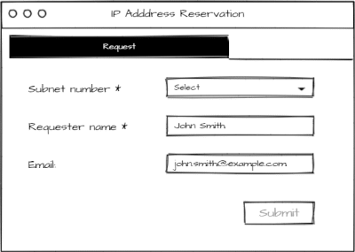
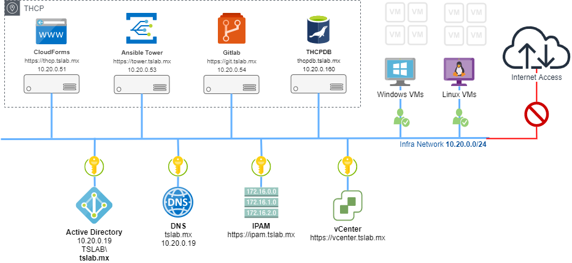

# 3er. Reto Automation2021 (Basado en un caso de uso real)

Este reto consiste en poder generar un reporte que muestre la siguiente direccion IP libre disponible en el sistema de IPAM (IP Address Management) de acuerdo a la subnet indicada (**subnetId: 3**), lo anterior deberá hacerse de manera automatizada y a través del consumo de los metodos que expone el API del PHPIPAM. 

Se debe crear un ítem en el catálogo de servicios de CloudForms como la interface de entrada del usuario donde el usuario deberá elegir la subnet de la cual desea el direccionamiento y correo del solicitante.

El reporte deberá ser enviado via correo electronico al destinatario que se haya ingresado en el formulario de la solicitud. Para mandar a invocar un *job tempalte* definido y declarado en **Ansible Tower**.

## Objetivo

El reto tiene como objetivo fortalecer los conocimientos adquiridos durante el entrenamiento, así como, ayudar a comprender el proceso de integracion y consulta de APIs mediante llamadas de tipo RESTful API desde Ansible. También se busca que el desarrollador se familiarice con el pase de variables desde CloudForms / ManageIQ hacia Ansible Tower mediante el uso de dialogos y la integración entre ambos componentes.

Así también se busca que el equipo de DevOps de la inicitativa Automatoin2021 se familiarice con el ambiente de desarrollo del Laboratorio donde se encuentran instalados los Componentes Core del T-HCP

## Detalles Técnicos
Para poder llevar a cabo este reto deberás tomar en cuenta lo siguiente:
1. Generar un token temporal para poder interactuar con el [API de PHPIPAM](https://phpipam.net/api/api_documentation)  

   - Usted debera usar las credenciales: *ansible/Automation2021* para poder generar el token temporal.
   - El App ID para este caso es: *automation*

> Para entender mejor el proceso de generación de tokens en el PHPIPAM referirse a la [Documentación oficial del proyecto](https://phpipam.net/api/api_documentation).

2. Una vez obtenido el token deberá utilizar el metodo correspondiente para solicitar la siguiente IP libre disponible.
3. Una vez obtenida dirección IP deberá:
   - Marcar la IP como ocupada y documentarla con los campos de owner, hostname y descripción.
   - Generar un reporte en formato HTML con los datos obtenidos.
4. Enviar un correo electronico al correo del solicitante con el reporte HTML adjunto.

> Todo lo anterior deberá llevarse acabo en el Ambiente de Desarrollo (TSMXLab) donde se encuentran instalados todos los componentes requeridos del T-HCP.

### Componentes Code del T-HCP a utilizar
- CloudForms: https://thcp.ts-lab.mx
- Ansible Tower:  https://tower.ts-lab.mx
- Gitlab: https://git.ts-lab.mx

### Instancia de pruebas de **PHPIPAM**
- PHPIPAM https://ipam.ts-lab.mx

### Software de referencia
- [Postman - API Client](https://www.postman.com/downloads/)

## Enlaces de referencia
- [Sitio oficial de PHPIPAM](https://www.phpipam.net)
- [Documentación API PHPIPAM](https://phpipam.net/api/api_documentation/)
- [A simple HTTP Request & Response Service](http://httpbin.org/)

## ¡¡Buena Suerte!! :